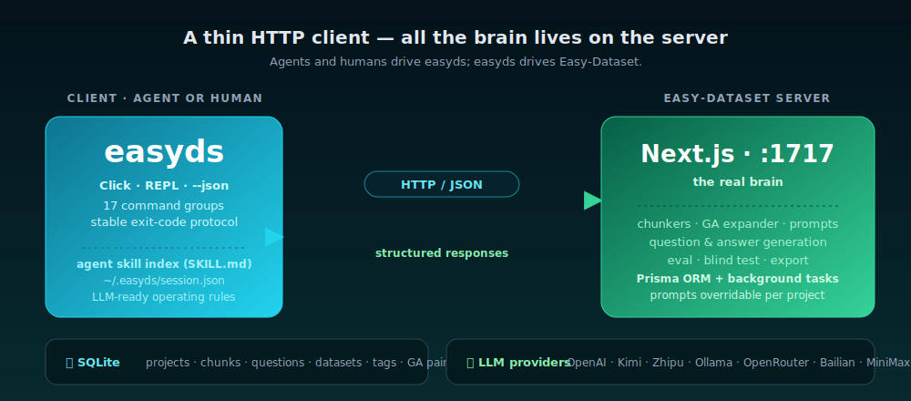

<div align="center">



<br>


**[Easy-Dataset](https://github.com/ConardLi/easy-dataset) için bir CLI ve agent ortamı — ince ayar veri seti boru hattının tamamını terminalinizden yönetin.**

[简体中文](./README.zh-CN.md) | [English](./README.md) | **Türkçe**

[Özellikler](#özellikler) • [Kurulum](#kurulum) • [Belgeler](plugins/easyds/skills/easyds/SKILL.md) • [Katkı](#katkı) • [Lisans](#lisans)

Bu projeyi beğendiyseniz, lütfen bir Star ⭐️ vermeyi unutmayın!

</div>

## Genel Bakış

**easy-dataset-cli** (`easyds`), insanların ve AI agent'larının [Easy-Dataset](https://github.com/ConardLi/easy-dataset)'in — belgeleri LLM ince ayar korporalarına dönüştüren açık kaynak boru hattının — tüm özelliklerini GUI'ye dokunmadan sürmesine olanak tanıyan, durum bilgisi tutan bir komut satırı ortamıdır. Çalışan bir Easy-Dataset Next.js sunucusuyla düz HTTP/JSON üzerinden konuşur; böylece upstream prompt kütüphanesi, chunk'layıcılar, alan ağacı oluşturucusu, GA genişletici, değerlendirici ve dışa aktarıcılar tıpkı tasarlandığı gibi çalışmaya devam eder. Bu temelin üzerine `easyds`, tek bir cilalı CLI koyar: 17 komut grubu, ~80 alt komut, çıkış kodu protokollü kararlı bir `--json` modu, etkileşimli bir REPL ve gömülü bir agent skill dizini — böylece CI boru hatları, otomasyon script'leri ve LLM agent'ları nihayet birinci sınıf bir arayüze sahip olur. Easy-Dataset'in güçlü sunucusu ile onu kullanmak isteyen otomatik iş akışları arasındaki eksik katmandır.

<div align="center">
  
</div>

## Haberler

🎉🎉 **easy-dataset-cli v1.0.1 — dataset-eval geri bildirim döngüsü geldi!** `easyds`, Easy-Dataset'in her yeteneğini sarmalamanın ötesinde, artık GUI'nin sunamadığı benzersiz bir kapalı döngü özelliği getiriyor: `datasets eval`, herhangi bir nihai Alpaca/ShareGPT dosyasında deterministik şema kontrolleri çalıştırır, başarısızlıkları düzeltmeden sorumlu olan boru hattı adımına atfeder, `--fix {chunk-join,unwrap-labels,render-placeholders}` ile yerelde güvenli onarımlar uygular ve isteğe bağlı olarak temellilik / doğruluk / netlik skorlaması için bir LLM jürisini çağırır — hepsi sunucuya dokunmadan. Bir LLM agent'ı artık *kendi veri setini değerlendirebilir, hangi adımı yeniden çalıştıracağına karar verebilir ve satırları yerelde onarabilir* — hepsi tek ve sıkı bir döngüde. Tüm hikaye için [`plugins/easyds/skills/easyds/reference/11-dataset-eval.md`](plugins/easyds/skills/easyds/reference/11-dataset-eval.md) belgesine bakın.

## Özellikler

### 🤖 AI Agent'ları için Tasarlandı

- **Her komutta `--json`** ve kararlı bir çıkış kodu protokolü (`0` ok, `2` sunucu hatası, `3` doğrulama, `4` bulunamadı, …) — agent'lar metin ayrıştırmadan hatalara tepki verebilir
- **Claude Code için tek komutla kurulum** — Claude Code eklentisi olarak dağıtılır, `/easyds-setup` slash komutuyla birlikte gelir; SKILL.md'ye elle yol göstermek gerekmez
- **Gömülü agent skill dizini** — [`plugins/easyds/skills/easyds/SKILL.md`](plugins/easyds/skills/easyds/SKILL.md) artı 16 referans belgesi ve 11 senaryo akışı. Bir LLM önceden bağlam olmadan operasyon kurallarını kavrar
- **Gerçek üretim koşularından damıtılmış operasyon kuralları** — `her zaman --ga`, `model use` sunucuya yazar, istemci `ReadTimeout` ≠ hata, özel prompt'lar katı JSON üretmelidir
- **Kararlı session durumu** — `~/.easyds/session.json` altında. Agent'lar her çağrıda `--project`'i tekrar iletmek zorunda değildir

### 🔌 Tam Easy-Dataset Kapsaması

- **Easy-Dataset API'siyle 1:1 eşleşen 17 komut grubu** — projects, models, prompts, files, chunks, tags, GA çiftleri, questions, datasets, tasks, distill, eval, eval-task, blind, export, status, repl
- **Belgelenmiş her yetenek sarmalandı** — chunk'lama stratejileri (text/document/separator/code), özel prompt'lar, GA genişletme, çok boyutlu değerlendirme, kör A/B testi, sıfır atış damıtma, çok turlu veri setleri, görsel VQA
- **Proje başına LLM yapılandırması** — OpenAI, Ollama, Zhipu, Kimi, OpenRouter, Alibaba Bailian, MiniMax ve OpenAI uyumlu tüm endpoint'ler
- **Zaten çözülmüş 13 bilinen sunucu tuhaflığı** — bunları üretim koşusunda tek tek öğrenmek zorunda değilsiniz ([`docs/SERVER_QUIRKS.md`](docs/SERVER_QUIRKS.md))

### 📊 Veri Seti Değerlendirme ve Geri Bildirim Döngüsü (easyds'e özgü)

- **Deterministik şema kontrolleri** — boş alanları, çift kodlanmış çıktıları, placeholder sızıntılarını, bozuk çok turlu kayıtları, duplikasyonları ve uzunluk aykırılıklarını kapsayan 9 kural
- **Başarısızlık atfı** — başarısız olan her kural, düzeltmeden sorumlu boru hattı adımına ve komuta çapraz referans verilir
- **Güvenli yerel onarımlar** — `--fix chunk-join`, `--fix unwrap-labels`, `--fix render-placeholders` yaygın başarısızlıkları sunucuyu yeniden çalıştırmadan yerinde onarır
- **İsteğe bağlı LLM jürisi** — `--llm-judge`, kayıtlardan örnek alır ve bunları OpenAI uyumlu herhangi bir endpoint'e karşı temellilik / doğruluk / netlik ekseninde skorlar
- **Session kapsamlı değerlendirme geçmişi** — `datasets eval-history`, bir agent'ın yeniden deneme döngülerini tespit etmesine ve iyileştirme ilerlemesini izlemesine olanak tanır

### 📤 Dışa Aktarma ve Entegrasyon

- **Üç dışa aktarma formatı** — Alpaca, ShareGPT, multilingual-thinking — `--include-cot`, `--score-gte` ve deterministik `--split train/valid/test` ile
- **Arka plan görev orkestrasyonu** — `easyds task wait`, uzun süreli sunucu işlerini zaman aşımıyla tamamlanana kadar yoklar, agent'lar yoklama mantığını elle yazmak zorunda değildir
- **Etiket başına dengeli örnekleme** — dışa aktarmada Easy-Dataset GUI semantiğine uyarlı

### 🛠️ Geliştirici Deneyimi

- **287 test yeşil** — birim, mock HTTP, stub sunucu ve kurulu alt süreç — ayrıca Kimi-K2.5'e karşı diske teslim edilmiş iki gerçek uçtan uca üretim koşusu
- **Editable kurulum + uv-kilitli bağımlılıklar** — yeniden üretilebilir geliştirme için
- **Tek ve temiz Python paketi** (PEP 621 + uv), yalnızca `easyds` tek giriş noktası

### 🌐 İnsanlar için de Cilalı

- **Etkileşimli REPL** — kalıcı geçmiş, markalı istem, sekme tamamlama. Alt komut olmadan `easyds` yazmanız yeterli
- Varsayılan olarak **zengin insan çıktısı**; parser istediğinizde `--json`'a geçin
- **Çok dilli belgeler** — 简体中文 / English / Türkçe — bu README dahil

## Hızlı Demo

> **Kayıt devam ediyor.** Gerçek bir Easy-Dataset sunucusuna karşı standart 7 adımlık boru hattının kısa bir terminal kaydı burada yer alacak. [`vhs`](https://github.com/charmbracelet/vhs) veya [`asciinema`](https://asciinema.org/) ile katkı yapmak için `assets/demo.gif`'e PR açın.

Bu arada, iki gerçek uçtan uca koşu yeniden üretilebilir tarifler olarak paketlenmiştir:

- **Kimi-K2.5 + Çince spec belgesi** — tam Alpaca dışa aktarımı, 200+ soru-cevap çifti
- **Kimi-K2.5 + ANSYS CFX öğreticileri** — özel prompt boru hattı, İngilizce soru-cevap, ShareGPT dışa aktarımı

CFX koşusundan damıtılmış üretim kalitesinde tarif için [`plugins/easyds/skills/easyds/reference/workflows/custom-prompt-pipeline.md`](plugins/easyds/skills/easyds/reference/workflows/custom-prompt-pipeline.md) dosyasına bakın.

## Kurulum

`easyds`'i nasıl süreceğinize göre bir yol seçin.

### 🥇 Claude Code kullanıcıları — tek tıkla eklenti

Claude Code içinde iki slash komutu çalıştırın:

```text
/plugin marketplace add Terry-cyx/easy-dataset-cli
/plugin install easyds@easy-dataset-cli
```

Bu işlem **agent skill**'i (SKILL.md + 16 referans belgesi + 11 senaryo akışı — Claude otomatik yükler) ve bir **`/easyds-setup`** slash komutunu birlikte kurar. Ardından yine Claude Code içinde çalıştırın:

```text
/easyds-setup
```

`/easyds-setup`, `easyds` CLI'ını `uv` ile (başarısız olursa `pip`'e geri dönerek) kurar, çalışan bir Easy-Dataset sunucusu olup olmadığını yoklar ve çalışmıyorsa üç seçeneğin hangisini tercih ettiğinizi sorar (Docker tek satır / masaüstü istemci / kaynaktan). Hepsi bu — elle `pip install` yok, elle SKILL.md yolu yazmak yok.

### 🥈 Diğer herkes — bağımsız CLI

> **⚠️ Paket isimleri hakkında uyarı.** `easy-dataset-cli` şu anda **PyPI'da yayınlanmış değil** ve PyPI'da `easyds` adlı ilgisiz bir paket (bir pandas yardımcısı) mevcut; o paket "başarıyla kurulur" ama size `easyds` ikilisi vermez. **`pip install easyds` veya `pip install easy-dataset-cli` çalıştırmayın** — kaynaktan kurun.

Sıfır kurulum çağrısı (hiçbir şey kurmadan, doğrudan GitHub'dan çalışır):

```bash
uvx --from git+https://github.com/Terry-cyx/easy-dataset-cli easyds --help
```

Veya bir kez kurun ve `PATH`'te kalsın:

```bash
# Tavsiye — GitHub'dan izole uv tool kurulumu:
uv tool install --upgrade git+https://github.com/Terry-cyx/easy-dataset-cli

# Veya uv ile mevcut ortama:
uv pip install "git+https://github.com/Terry-cyx/easy-dataset-cli"

# Veya düz pip ile:
pip install "git+https://github.com/Terry-cyx/easy-dataset-cli"

# Veya yerel bir klondan editable geliştirici kurulumu:
git clone https://github.com/Terry-cyx/easy-dataset-cli
cd easy-dataset-cli && pip install -e .
```

**Python 3.10+** gerekir. Kurulumdan sonra `easyds --version` ile doğrulayın — çıktı `1.0.1` veya daha yeni olmalıdır. Eğer `0.1.1` yazıyorsa, ilgisiz ismi çalınmış paketi kurmuşsunuzdur — `uv tool uninstall easyds` (veya `pip uninstall easyds`) yapın ve yukarıdaki komutu yeniden çalıştırın.

### Easy-Dataset sunucusu (her iki yol için de zorunlu ön koşul)

`easyds` ince bir HTTP istemcisidir — chunk'lama, alan ağacı üretimi veya LLM çağrılarını yeniden uygulamaz. Her şeyi gerçek bir Easy-Dataset sunucusuna iletir ve bu sunucunun herhangi bir komut çalışmadan önce erişilebilir olması gerekir. Birini seçin:

```bash
# Seçenek 1 — Docker (en hızlı):
docker run -d --name easy-dataset -p 1717:1717 \
    -v "$PWD/local-db:/app/local-db" \
    -v "$PWD/prisma:/app/prisma" \
    ghcr.io/conardli/easy-dataset

# Seçenek 2 — Windows / macOS / Linux masaüstü istemci:
#   https://github.com/ConardLi/easy-dataset/releases/latest

# Seçenek 3 — kaynaktan (geliştiriciler için):
git clone https://github.com/ConardLi/easy-dataset
cd easy-dataset && pnpm install && pnpm dev   # http://localhost:1717 üzerinde sunar
```

> Easy-Dataset'in **yerleşik kimlik doğrulaması yoktur** — onu localhost'ta veya kendi kimlik doğrulama proxy'nizin arkasında çalıştırın.

## Hızlı Başlangıç — standart 7 adımlık boru hattı

```bash
# 0. Sunucunun erişilebilir olduğunu doğrulayın.
easyds --json status

# 1. Bir proje oluşturun.
easyds --json project new --name my_dataset

# 2. Bir LLM modelini kaydedin ve etkinleştirin (hem yerel session'a hem de
#    sunucu tarafındaki defaultModelConfigId'ye yazar — GA / görsel VQA için zorunlu).
easyds --json model set \
    --provider-id openai \
    --endpoint   https://api.openai.com/v1 \
    --api-key    sk-... \
    --model-id   gpt-4o-mini
easyds --json model use <2-adımdan-gelen-id>

# 3. Bir belge yükleyin (yalnızca .md veya .pdf).
easyds --json files upload ./spec.md

# 4. Chunk'layın (aynı zamanda LLM ile bir alan ağacı kurar).
easyds --json chunks split --file spec.md

# 5. Sorular üretin. --ga ZORUNLUDUR — GA olmayan mod sunucuda bozuk.
easyds --json questions generate --ga --language 中文

# 6. Cevapsız her soru için cevap + düşünce zinciri (CoT) üretin.
easyds --json datasets generate --language 中文

# 7. Dışa aktarın.
easyds --json export run \
    -o ./alpaca.json \
    --format alpaca \
    --all --overwrite

# 8. (easyds'e özgü) Nihai dosyayı değerlendirin ve otomatik onarın.
easyds --json datasets eval ./alpaca.json
```

Tüm döngü bu kadar: **status → project → model → upload → chunk → questions → answers → export → evaluate** — tekrarlanabilir, script'lenebilir, agent tarafından sürülebilir.

## Belgeler

- **[`plugins/easyds/skills/easyds/SKILL.md`](plugins/easyds/skills/easyds/SKILL.md)** — ince agent skill dizini; Claude Code eklenti kullanıcılarına otomatik yüklenir, diğerleri için elle okunur
- **[`plugins/easyds/skills/easyds/reference/`](plugins/easyds/skills/easyds/reference/)** — standart boru hattı, özel prompt kuralları, operasyon kuralları, agent protokolü, görev ayarları, PDF/veri temizleme, soru şablonları ve dataset-eval geri bildirim döngüsü dahil 16 referans belgesi
- **[`plugins/easyds/skills/easyds/reference/workflows/`](plugins/easyds/skills/easyds/reference/workflows/)** — 11 senaryo tarifi (özel prompt boru hattı, duygu sınıflandırma, belge temizleme, görsel VQA, çok turlu damıtma, GA/MGA çiftleri, değerlendirme & kör test, alan ağacı düzenleme, içe aktarma/temizleme/optimize, arka plan görevleri, kalite kontrol)
- **[`docs/SERVER_QUIRKS.md`](docs/SERVER_QUIRKS.md)** — CLI'ın çözdüğü 13 bilinen Easy-Dataset sunucu tuhaflığı
- **Upstream Easy-Dataset belgeleri**: [https://docs.easy-dataset.com/](https://docs.easy-dataset.com/)

## Topluluk Uygulaması

- **Kimi-K2.5'e karşı özel prompt boru hattı** — ANSYS CFX öğreticilerinden uçtan uca İngilizce soru-cevap, özel soru + değerlendirme prompt'larıyla
- **Duygu sınıflandırma veri seti** — ayırıcı tabanlı chunk'lama + etiket şablonu + `--fix chunk-join` onarımı, `datasets eval` geri bildirim döngüsüyle doğrulandı
- **Belge temizleme yeniden çekimi** — uzun gürültülü PDF → toplu temizleme → skorlu soru-cevap → skor filtreli dışa aktarım
- **Slayt dizininden görsel VQA veri seti** — görsel model tabanlı cevap üretimi

Yukarıdakilerin tümü [`plugins/easyds/skills/easyds/reference/workflows/`](plugins/easyds/skills/easyds/reference/workflows/) altında çalıştırılabilir senaryo tarifleri olarak kodlanmıştır.

## Katkı

Katkılar çok memnuniyetle karşılanır! `easy-dataset-cli`'a katkıda bulunmak için:

1. Depoyu fork'layın
2. Yeni bir dal oluşturun (`git checkout -b feature/amazing-feature`)
3. Geliştirme ortamını kurun:
   ```bash
   uv sync --extra test
   uv run easyds --version
   uv run pytest                       # → 287 başarılı
   ```
4. Değişikliklerinizi yapın ve `tests/` altında testler ekleyin
5. Değişiklikleri commit'leyin (`git commit -m 'Add some amazing feature'`)
6. Dalı push'layın (`git push origin feature/amazing-feature`)
7. `main` dalına karşı bir Pull Request açın

Lütfen `pytest`'in yeşil kalmasını sağlayın ve mevcut kodlama stiline uyun (CLI için Click, ince `requests` tabanlı backend, her Easy-Dataset domain'i için bir `core/` modülü).

## Lisans

Bu proje **AGPL-3.0-or-later** lisansı altında lisanslanmıştır — ayrıntılar için [LICENSE](LICENSE) dosyasına bakın. Upstream Easy-Dataset ile aynı lisans.

## İlgili Projeler

- **[Easy-Dataset](https://github.com/ConardLi/easy-dataset)** — `easyds`'in sürdüğü upstream Next.js + Prisma sunucusu. Zorunlu çalışma zamanı bağımlılığı.

## Star Geçmişi

[](https://www.star-history.com/#Terry-cyx/easy-dataset-cli&Date)

<div align="center">
  <sub><a href="https://github.com/ConardLi/easy-dataset">Easy-Dataset</a> için bir CLI ortamı — hem insanlar hem de agent'lar için inşa edildi.</sub>
</div>
